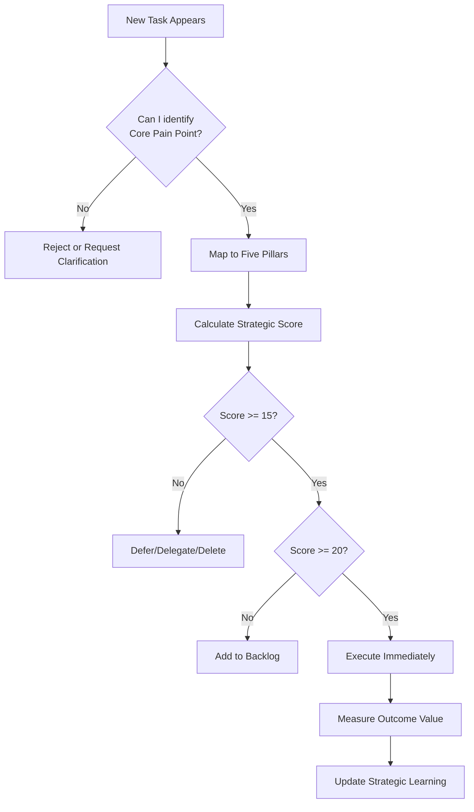

[](https://github.com/vanHeemstraSystems/task-management/actions/workflows/publish.yml)

task-management

# Task Management

> “Don’t start with the task—start with the problem it solves.”

Can be read as “Task Management” at https://app.gitbook.com/s/Rs3XPuVclvoj92Exb9AA/

Can be browsed as “Task Management” at https://vanheemstrasystems.github.io/task-management/

Documentation of this repository is automatically done with Quarto using GitHub Actions as described at https://github.com/vanHeemstraSystems/quarto-to-github-pages/blob/main/300/300/README.md

Based on “How to Run PostgreSQL and pgAdmin Using Docker” at https://towardsdatascience.com/how-to-run-postgresql-and-pgadmin-using-docker-3a6a8ae918b5

Based on “Super Productivity” at https://github.com/johannesjo/super-productivity

Based on “Five Pillars of Your Strategy” at https://github.com/vanHeemstraSystems/strategic-planning-management/blob/main/300/900/100/050/README.md

Based on “The Creation Principle of Integrity: Think It, Speak It, Act It, It Happens” at https://www.youtube.com/watch?v=FEIrrPaWuPc

Based on “The top 1% Think on Paper. Here’s How To Do It.” at https://www.youtube.com/watch?v=tGrMjRqQGVY


<table>
<th colspan="5">Summarize with:</th><tr/> 
<td><a href="https://chat.openai.com/?q=please+read+and+summarize+the+content+from+this+url+https://github.com/vanHeemstraSystems/task-management/">ChatGPT</a></td>
<td><a href="https://x.com/i/grok?text=please+read+and+summarize+the+content+from+this+url+https://github.com/vanHeemstraSystems/task-management/">Grok</a></td>
<td><a href="https://www.google.com/search?udm=50&aep=11&q=please+read+and+summarize+the+content+from+this+url+https://github.com/vanHeemstraSystems/task-management/">Google AI Mode</a></td>
<td><a href="https://www.perplexity.ai/search/new?q=please+read+and+summarize+the+content+from+this+url+https://github.com/vanHeemstraSystems/task-management/">Perplexity</a></td>
<td><a href="https://claude.ai/new?q=please+read+and+summarize+the+content+from+this+url+https://github.com/vanHeemstraSystems/task-management/">Claude.ai</a></td>  
</table>

-----

## Strategic Task Processing Framework

### Philosophy: From Task Lists to Problem Solving

Traditional task management treats tasks as items to check off. **Strategic task management** views each task through the lens of strategic problem-solving, ensuring every action creates meaningful value.

### The Five Pillars of Strategic Task Processing

Before processing any task, evaluate it through these five strategic lenses:

#### 1. **Core Pain Point**

*What fundamental problem does this task address?*

Don’t just ask “What needs to be done?” Ask “What pain point exists that makes this task necessary?”

**Example:**

- ❌ Traditional: “Update project documentation”
- ✅ Strategic: “Team members waste 2 hours/week searching for project context”

#### 2. **Underlying Need**

*What deeper need drives this task’s existence?*

Translate the pain point into a concrete need statement.

**Example:**

- Pain Point: “Team members waste time searching for context”
- Underlying Need: “To provide instant access to project knowledge for all stakeholders”

#### 3. **Stakeholders**

*Who benefits when this task is completed?*

Identify your “patrons”—the people whose lives improve when this task succeeds.

**Example:**

- Primary: Development team, product managers
- Secondary: Customer support, new hires
- Tertiary: End customers (through faster feature delivery)

#### 4. **Context & Domain**

*Where does this task create impact?*

Define the boundaries and scope of influence.

**Example:**

- Technical domain: Documentation systems, knowledge base
- Business domain: Team productivity, onboarding efficiency
- Time domain: Immediate (this sprint) vs. Long-term (6 months)

#### 5. **Outcome Value**

*What specific, measurable value will completion deliver?*

Define the unique value this task creates—not just “done” but “what changes.”

**Example:**

- ❌ “Documentation is updated”
- ✅ “Team reduces context-searching time by 80%, new hires onboard 2 days faster”

-----

### Strategic Task Evaluation Matrix

Before accepting a task into your workflow, score it:

```
Task: _________________________________

[ ] Core Pain Point (0-5): How significant is the problem?
[ ] Underlying Need (0-5): How essential is this need?
[ ] Stakeholder Impact (0-5): How many people benefit?
[ ] Context Clarity (0-5): How well-defined is the scope?
[ ] Outcome Value (0-5): How measurable is the value?

STRATEGIC SCORE: ___/25

Decision Thresholds:
- 20-25: Strategic priority - execute immediately
- 15-19: High value - schedule this sprint
- 10-14: Moderate value - backlog with clear timeline
- 5-9: Low value - defer or delegate
- 0-4: Strategic misalignment - reject or reframe
```

-----

### Task Direction vs. Task Goals

**Traditional approach:** Set a task goal and follow it.

**Strategic approach:** Choose a task *direction* that aligns with strategic pillars.

|Traditional Goal-Based    |Strategic Direction-Based                           |
|--------------------------|----------------------------------------------------|
|“Complete 10 tasks today” |“Solve the top 3 pain points blocking team velocity”|
|“Update all documentation”|“Eliminate documentation friction points first”     |
|“Respond to all emails”   |“Address stakeholder blockers first”                |

**Key insight:** A mistake in your very first task can be fatal to your day’s productivity. Choose direction over arbitrary completion.

-----

### Strategic Task Intake Process

When a new task appears, don’t ask “Can I do this?” Ask:

1. **Do I know which Core Pain Point this task solves today?**
1. **Do I know which Core Pain Point this task will solve tomorrow?**
1. **If I asked my team which Underlying Needs are priority, would they all give the same answer?**
1. **Does this task create new customers/value, or just maintain existing systems?**

If you can’t answer these questions, you’re reading the label from inside the bottle. Step back and reframe.

-----

### Anti-Patterns to Avoid

❌ **Starting with ambitious task goals** (“I’ll complete 50 tasks this week”)

- Instead: Identify the biggest pain points and solve those first

❌ **Task list shopping** (working from someone else’s priority list)

- Instead: Rewrite the context by solving Big Problems others ignore

❌ **Confusing activity with progress** (being busy vs. being effective)

- Instead: Measure value delivered, not tasks completed

❌ **Accepting tasks as “facts of life”** (maintaining broken systems)

- Instead: Question whether the task should exist at all

-----

### Implementation: Strategic Task Database Schema

The task management system should capture strategic metadata:

```sql
CREATE TABLE strategic_tasks (
    task_id SERIAL PRIMARY KEY,
    
    -- Traditional fields
    title VARCHAR(255),
    description TEXT,
    status VARCHAR(50),
    
    -- Strategic Five Pillars
    core_pain_point TEXT,              -- What problem does this solve?
    underlying_need TEXT,               -- What need drives this?
    stakeholders JSONB,                 -- Who benefits? {primary: [], secondary: []}
    context_domain JSONB,               -- Where does impact occur? {technical: [], business: [], temporal: []}
    outcome_value TEXT,                 -- What measurable value is created?
    
    -- Strategic Scoring
    pain_point_score INT CHECK (pain_point_score BETWEEN 0 AND 5),
    need_score INT CHECK (need_score BETWEEN 0 AND 5),
    stakeholder_score INT CHECK (stakeholder_score BETWEEN 0 AND 5),
    context_score INT CHECK (context_score BETWEEN 0 AND 5),
    value_score INT CHECK (value_score BETWEEN 0 AND 5),
    strategic_total INT GENERATED ALWAYS AS (
        pain_point_score + need_score + stakeholder_score + 
        context_score + value_score
    ) STORED,
    
    -- Strategic Classification
    task_direction VARCHAR(100),        -- e.g., "Eliminate onboarding friction"
    strategic_alignment BOOLEAN,        -- Does this align with current strategy?
    
    created_at TIMESTAMP DEFAULT CURRENT_TIMESTAMP,
    updated_at TIMESTAMP DEFAULT CURRENT_TIMESTAMP
);

-- Index for strategic priority queries
CREATE INDEX idx_strategic_priority ON strategic_tasks(strategic_total DESC, created_at);

-- Index for alignment filtering
CREATE INDEX idx_strategic_alignment ON strategic_tasks(strategic_alignment, strategic_total DESC);
```

-----

### Task Processing Workflow



-----

### Strategic Task Review Questions

**Daily:**

- What Core Pain Point did I solve today?
- Did I work on tasks or on problems?

**Weekly:**

- Are my completed tasks aligned with strategic direction?
- What Underlying Needs emerged that I didn’t anticipate?

**Monthly:**

- Am I solving Big Problems or just maintaining systems?
- Would my stakeholders describe the same priorities I’m working on?

-----

## Technical Setup

Create yarn.lock file as follows:

```
$ cd containers/app/main
$ yarn install
```

Run as follows:

```
$ cd containers/app
$ docker-compose --file docker-compose.dev.yml --project-name task-management-dev up --build -d
```

**NOTE**: When you try to login to PostgreSQL database via **pgAdmin** (Recommended), use the following credentials:

- Email Address / Username: = Use the value of PGADMIN_DEFAULT_EMAIL_DEV/PROD as specified in the .env file
- Password: Use the value of PGADMIN_DEFAULT_PASSWORD_DEV/PROD as specified in the .env file

Inside pgAdmin register a new Server using the following credentials:

From the menu choose File > Register … Server:

In tab **General**:

- Name: Use a name like “task-management-dev” (if for development) - REQUIRED

In tab **Connection**:

- Host name/address: localhost
- Port: Use the value of port as specified in the docker-compose file
- Maintenance database: postgres
- Username: Use the value of POSTGRES_USERNAME_DEV/PROD as specified in .env file
- Password: Use the value of POSTGRES_PASSWORD_DEV/PROD as specified in .env file

**NOTE**: When you try to login to PostgreSQL database via **Adminer**, use the following credentials:

- System: PostgreSQL
- Server: = IP address and exposed postgresql port (e.g. :5432) of the Docker host =
- Username: Postgres
- Password: = can be set or found in your environment variables file .env =
- Database: = leave this blank =

If you tick the “Permanent login” box, next time you visit the login page, your previous shortcut will be shown.

-----

## Conclusion

**Traditional task management** asks: “What’s on my list?”

**Strategic task management** asks: “What Big Problem am I solving today?”

The scale of your productivity isn’t determined by your ambition to complete tasks. It depends on the scale of the problems you solve.

Don’t let your task list be a shopping list you didn’t write. Identify the Underlying Needs that everyone else is ignoring, and make solving those your strategic direction.

TO DO: Implement the advise given in [BUSINESS_MODEL_ENHANCEMENT.md](./BUSINESS_MODEL_ENHANCEMENT.md).


